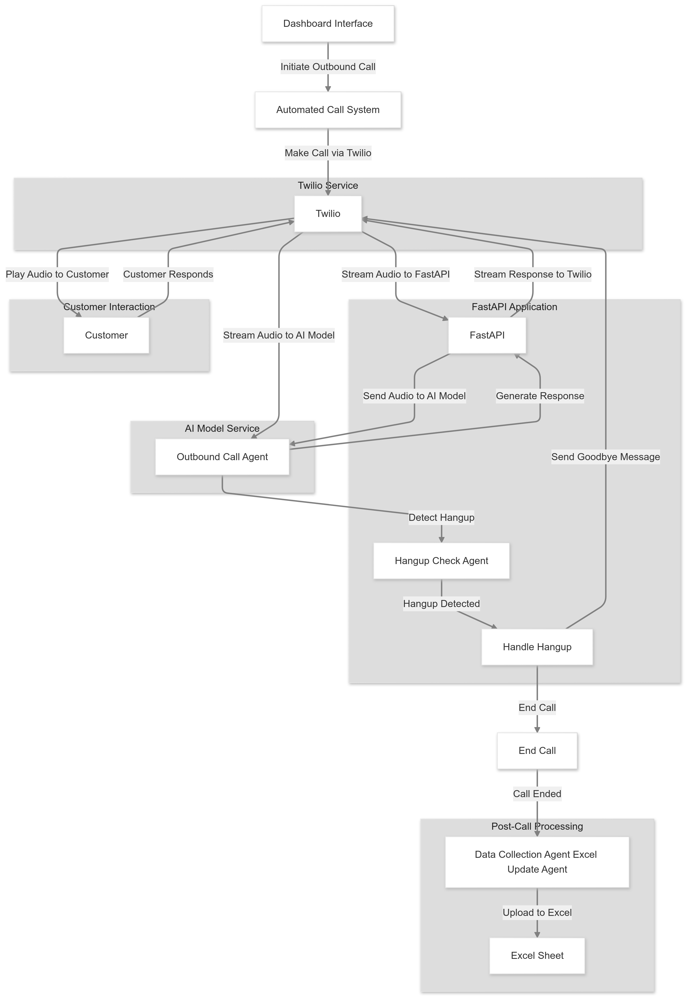

# **SmartLine: AI-Powered Call Center Automation**

SmartLine is an advanced AI-powered automation platform designed to replace traditional human call center agents with intelligent AI agents. These agents can handle a wide range of business tasks, including customer support, lead generation, order confirmation, and more. Built with **Django** (backend), **React.js** (frontend), and **MySQL** (database), for **Inbound & outbound** call agents built with **Twilio**, **OpenAI API**, and **LangChain**, SmartLine is a scalable and efficient solution for businesses looking to automate their operations.

---

## **Table of Contents**

1. [Project Overview](#project-overview)
2. [Inbound and Outbound Call System](#inbound-and-outbound-call-system)
   - [Inbound Call System](#inbound-call-system)
   - [Outbound Call System](#outbound-call-system)
3. [Unique Features](#unique-features)
4. [Live Demo](#live-demo)
5. [Key Features](#key-features)
6. [Technologies Used](#technologies-used)
7. [Prerequisites](#prerequisites)
8. [Installation](#installation)
   - [Backend (Django)](#backend-django)
   - [Frontend (React.js)](#frontend-reactjs)
9. [Deployment](#deployment)
   - [Frontend (Vercel)](#frontend-vercel)
   - [Backend (PythonAnywhere)](#backend-pythonanywhere)
10. [AI Agent Workflow](#ai-agent-workflow)
    - [Outbound Call Automation Workflow](#outbound-call-automation-workflow)
11. [License](#license)
12. [Key Pages](#key-pages)
13. [Project Context](#project-context)
14. [Screenshots](#screenshots)

---

## **Project Overview**

SmartLine is designed to streamline and automate call center operations, reducing the need for human intervention while maintaining high levels of customer satisfaction. By leveraging AI technologies, SmartLine provides a cost-efficient and scalable solution for businesses of all sizes.

---

## **Inbound and Outbound Call System**

### **Inbound Call System**

The **Inbound Call System** is designed to handle incoming customer support calls. It uses Twilio's WebSocket API to stream audio in real-time and OpenAI's GPT model to generate responses.

#### **Key Features**:
- Real-time audio streaming using Twilio WebSocket.
- Integration with OpenAI for natural language processing.
- Automated responses for customer queries.
- Transcript logging for each call.

#### **How It Works**:
1. When a call is received, Twilio sends a request to the `/stream/incoming-call` endpoint.
2. The system establishes a WebSocket connection with Twilio and OpenAI.
3. Audio is streamed in real-time, and OpenAI generates responses based on the conversation.
4. The call transcript is logged for future reference.


---

### **Outbound Call System**

The **Outbound Call System** is used for making automated calls for:
- Lead generation.
- Order status updates.
- Order confirmations.

#### **Key Features**:
- Automated outbound calls using Twilio.
- Real-time interaction with customers using OpenAI.
- Customizable initial messages for different use cases.
- Transcript logging for each call.

#### **How It Works**:
1. The system initiates an outbound call using Twilio's API.
2. A WebSocket connection is established with Twilio and OpenAI.
3. The AI introduces itself and interacts with the customer based on predefined prompts.
4. The call transcript is logged for future reference.



---

## **Unique Features**

- **Inbound and Outbound Calls**: Handle both incoming and outgoing calls seamlessly.
- **Multilingual Support**: Communicate with customers in multiple languages.
- **Order Status Checking**: Automatically check and update order statuses.
- **Item Search**: Search for products or services during customer interactions.
- **Smart Hangup**: Detect when a call ends and automatically hang up.
- **Transcript and Summary**: Provide a full transcript and summary of each call.
- **Post-Call Processing (Google Sheets Integration)**: Add and edit data in Google Sheets for order confirmations and lead generation.

---

## **Live Demo**

Explore the live demo of SmartLine:  
🌐 [SmartLine Live Demo](https://test-eight-zeta-80.vercel.app/)  
📹 [Video of the AI agents before the integration](https://drive.google.com/file/d/1laPzp-da437sSdDf62HsXd2tCMaSi42J/view?usp=sharing)

---

## **Key Features**

- **AI-Powered Agents**: Intelligent agents capable of handling customer interactions, sales, and support tasks.
- **Task Automation**: Automate repetitive tasks such as appointment scheduling, order tracking, and FAQs.
- **Edits on Spreadsheets**: Puts the output of the call (summary, transcript, and order name) on a spreadsheet for the owner to see.
- **Real-Time Analytics**: Monitor agent performance, customer satisfaction, and task completion rates.
- **Customizable Workflows**: Tailor AI agents to suit specific business needs.

---

## **Technologies Used**

- 
- 
- 
- 
- 
- 

---

## **Prerequisites**

Before running the project, ensure you have the following installed:

- Python 3.12
- Node.js and npm
- MySQL Server
- Django
- React.js

---

## **Installation**

### **Backend (Django)**

1. Clone the repository:
   ```bash
   git clone https://github.com/redaelkate/smartline.git
   cd smartline/backend
   ```

2. Create a virtual environment and activate it:
   ```bash
   python -m venv venv
   source venv/bin/activate  # On Windows: venv\Scripts\activate
   ```

3. Install dependencies:
   ```bash
   pip install -r requirements.txt
   ```

4. Set up the MySQL database:
   - Create a database in MySQL.
   - Update the `settings.py` file with your database credentials:
     ```python
     DATABASES = {
         'default': {
             'ENGINE': 'django.db.backends.mysql',
             'NAME': 'your_database_name',
             'USER': 'your_database_user',
             'PASSWORD': 'your_database_password',
             'HOST': 'localhost',
             'PORT': '3306',
         }
     }
     ```

5. Run migrations:
   ```bash
   python manage.py migrate
   ```

6. Start the Django development server:
   ```bash
   python manage.py runserver
   ```

### **Frontend (React.js)**

1. Navigate to the frontend directory:
   ```bash
   cd ../frontend
   ```

2. Install dependencies:
   ```bash
   npm install
   ```

3. Start the React development server:
   ```bash
   npm start
   ```

---

## **Deployment**

### **Frontend (Vercel)**

The frontend is deployed on Vercel. To deploy your own version:
1. Install the Vercel CLI:
   ```bash
   npm install -g vercel
   ```
2. Deploy the frontend:
   ```bash
   cd frontend
   vercel
   ```

### **Backend (PythonAnywhere)**

The backend can be deployed on PythonAnywhere. To deploy:
1. Create a new WebApp on PythonAnywhere.
2. Upload your Django files.
3. Set environment variables for your database and Django settings.
4. Deploy!

---

## **AI Agent Workflow**

SmartLine's AI agents are designed to handle the following tasks:
1. **Customer Support**: Answer FAQs, resolve issues, and escalate complex queries.
2. **Sales**: Recommend products, process orders, and upsell/cross-sell.
3. **Appointment Scheduling**: Book, reschedule, and cancel appointments.
4. **Data Collection**: Gather customer feedback and insights for analytics.

### **Outbound Call Automation Workflow**

The system uses **Twilio** for call automation and **FastAPI** for real-time audio streaming and AI integration. Here’s how the workflow operates:

1. **Initiate Outbound Call**:
   - The system initiates an outbound call using the **Twilio Service**.
   - The **Twilio Agent** handles the call setup and connection.

2. **Play Audio to Customer**:
   - Once the call is connected, the system plays pre-recorded or dynamically generated audio to the customer.

3. **Customer Responds**:
   - The customer’s response is captured and streamed to the **FastAPI Application**.

4. **Stream Audio to AI Model**:
   - The **FastAPI Agent** streams the customer’s audio to the **AI Model Service** for processing.

5. **Generate Response**:
   - The **AI Model Agent** analyzes the audio and generates an appropriate response.
   - The response is sent back to the **FastAPI Agent**.

6. **Stream Response to Twilio**:
   - The generated response is streamed back to the customer via the **Twilio Service**.

7. **Handle Hangup**:
   - The **Hangup Check Agent** continuously monitors the call for a hangup signal.
   - If a hangup is detected, the **Handle Hangup Agent** terminates the call and triggers post-call processing.

8. **Post-Call Processing**:
   - The **Data Collection Agent** collects call data and updates the **Excel Sheet** for reporting and analytics.

---

## **License**

This project is licensed under the MIT License. See the [LICENSE](LICENSE) file for details.

---

## **Key Pages**

- **Dashboard**: Overview of AI agent performance, task completion rates, and customer satisfaction.
- **Agents**: Customize AI agent behavior, workflows, and integrations.
- **Call Logs**: View detailed logs of all outbound and inbound calls.
- **Analytics**: Monitor key metrics such as call duration, customer satisfaction, and agent performance.

---

## **Project Context**

This project, SmartLine, was developed as part of a hackathon organized by [**AI Crafters**](https://aicrafters.com/). The hackathon focused on building voice bots, and SmartLine emerged as a promising solution designed to streamline call center operations.

---

## **Screenshots**


